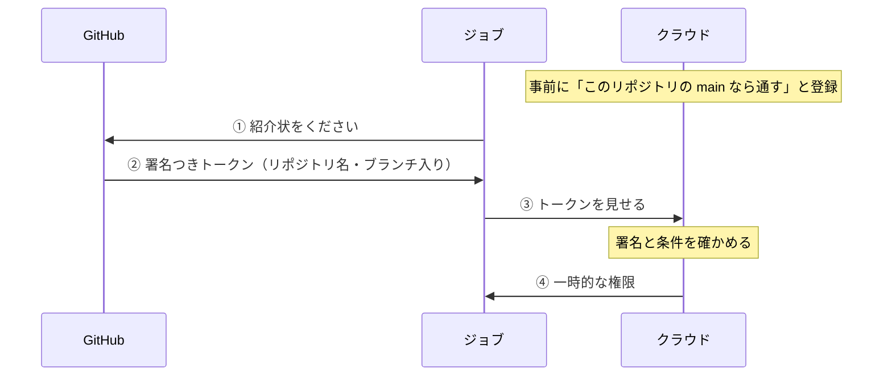

GitHub から Firebase へ自動デプロイを設定したことがある人は多いと思います。では、その設定は安全なのでしょうか。GitHub の公式ドキュメントでは「OIDC を使うと安全になる」と説明されています。ただ、何がどう安全になるのか、どこに穴が残るのかは、読んだだけでは掴みにくいところです。

この記事では、次の公式ドキュメントに書かれていることだけをもとに、OIDC 連携の仕組みと安全性、気を付ける点を整理します。

- [OpenID Connect（GitHub Docs）](https://docs.github.com/ja/actions/concepts/security/openid-connect)：GitHub が OIDC の仕組みとトークンの中身を説明したページです
- [Configuring OpenID Connect in Amazon Web Services（GitHub Docs）](https://docs.github.com/en/actions/security-for-github-actions/security-hardening-your-deployments/configuring-openid-connect-in-amazon-web-services)：AWS と連携するときの設定手順です
- [google-github-actions/auth](https://github.com/google-github-actions/auth)：Google Cloud にログインするための、Google 公式のアクションです
- [Deploy to live & preview channels via GitHub pull requests（Firebase Docs）](https://firebase.google.com/docs/hosting/github-integration)：`firebase init hosting:github` が何をするかを説明したページです
- [FirebaseExtended/action-hosting-deploy](https://github.com/FirebaseExtended/action-hosting-deploy)：Firebase Hosting にデプロイするための公式アクションです
- [GHSA-mrrh-fwg8-r2c3](https://github.com/advisories/GHSA-mrrh-fwg8-r2c3)：2025 年に起きた `tj-actions/changed-files` 侵害の勧告です

資料に書かれていない推測は、そうと分かるように書きます。

## 仕組み：合鍵と一日入館証

OIDC 連携は、会社の受付にたとえると分かりやすくなります。

| たとえ | 実際のもの |
|---|---|
| 派遣会社 | GitHub |
| 派遣されてくる作業員 | ジョブ（自動デプロイなどの作業） |
| 作業先のビル | Google Cloud や AWS などのクラウド |
| 派遣会社の印鑑つき紹介状 | GitHub が発行する OIDC トークン |
| 一日入館証 | クラウドが渡す一時的な権限 |

### 昔のやり方は合鍵

ビルの合鍵を作り、派遣会社の金庫に預けておくやり方です。合鍵にあたるのは AWS のアクセスキーや Google Cloud の JSON キーで、金庫にあたるのが GitHub の Secrets です。ワークフローからは `${{ secrets.XXX }}` の形で取り出します。合鍵には期限がないので、コピーされたら、いつでも勝手に入られてしまいます。

### OIDC のやり方は紹介状

1. 最初に一度だけ、ビルの受付に「○○派遣会社の△△チームの人なら入れてよい」と登録する
2. 作業のたびに、派遣会社が「この人は△△チームです」と書いた紹介状に印鑑を押して渡す
3. 作業員は受付で紹介状を見せ、受付は印鑑が本物か、△△チームの人かを確かめる
4. 受付は一日入館証を渡し、作業が終わればその入館証は使えなくなる

GitHub の公式ドキュメントは、OIDC の利点として次の 3 つを挙げています。

- クラウドの秘密情報を GitHub に保存しなくてよい
- 権限の細かい管理を、クラウド側の仕組みで行える
- トークンは 1 つのジョブの間だけ有効で、自動的に失効する

流れをまとめると、次のようになります。



## Google Cloud と AWS での設定

どちらのクラウドも仕組みは同じで、受付の呼び名が違うだけです。

| クラウド | 受付の名前 | 最初に登録すること | ワークフローで使うアクション |
|---|---|---|---|
| Google Cloud | Workload Identity 連携 | 発行元 `https://token.actions.githubusercontent.com` と、通す条件 | `google-github-actions/auth` |
| AWS | IAM の ID プロバイダーとロール | 同じ発行元、対象 `sts.amazonaws.com`、ロールの信頼ポリシーに書く条件 | `aws-actions/configure-aws-credentials` |

どちらの場合も、ワークフローには `permissions: id-token: write` を書きます。AWS の手順ページでは、JWT を要求するためにこの権限が必要だと説明されています。

AWS の手順ページには、信頼ポリシーに書く条件の例が載っています。

```json
"token.actions.githubusercontent.com:sub": "repo:octo-org/octo-repo:ref:refs/heads/octo-branch"
```

この例は「`octo-org/octo-repo` リポジトリの `octo-branch` ブランチから来たジョブだけを通す」という意味です。

`google-github-actions/auth` の README には、Workload Identity のプールに入れる条件（Attribute Condition）を必ず付けるよう、警告つきで書かれています。

## 紹介状は偽造できるのか

紹介状の中身を、ジョブや GitHub の利用者が書き換えることはできません。

- トークンは GitHub の秘密鍵で署名されていて、クラウドは発行元 `https://token.actions.githubusercontent.com` が公開している公開鍵で署名を確かめる
- リポジトリ名やブランチは GitHub 自身が書き込むので、ワークフローに何を書いてもトークンの中身は変わらない
- 中身を変えると署名が合わなくなり、クラウドに拒否される

ただし「偽造できない」ことと「悪用されない」ことは別の話です。紹介状は「△△チームの作業員」なら本物が出ます。つまり、△△チームに入れる人、言いかえればリポジトリに書き込める人なら、本物の紹介状を正規の手続きで手に入れられます。

| 誰が | できるか |
|---|---|
| 部外者が紹介状を偽造する | できない（GitHub 自体が破られない限り） |
| リポジトリに書き込める人が悪用する | 条件がゆるいとできる |
| メンバーのアカウントを乗っ取った人が悪用する | 条件がゆるいとできる |
| 細工された他人のアクション | そのジョブが持つ権限の範囲でできる |

## 気を付ける点

穴になりやすいのは、クラウド側に登録した条件のゆるさです。次の表は、筆者が起きやすいと考える順に並べています。

| 穴 | 何が起きるか | 対策 |
|---|---|---|
| 条件が組織名だけ、またはワイルドカード | 関係ないリポジトリや、これから作るリポジトリからも入れる | リポジトリを 1 つに絞る |
| リポジトリ名だけを確かめ、ブランチを見ていない | 書き込める人なら、適当なブランチを push するだけで本番にデプロイできる | `sub` をブランチまで絞る。または environment を使い、本番は承認必須にする |
| メンバーのアカウントの乗っ取り | 犯人がそのメンバーとして上と同じことをできる | 二段階認証を必須にする。書き込み権限を必要な人だけにする |
| 他人のアクションの乗っ取り | 正規のジョブの中で悪いコードが動く | アクションをコミット SHA で固定する。`id-token: write` はデプロイするジョブだけに付ける |
| フォークのコードを権限つきで実行する（`pull_request_target` など） | 部外者のコードが本物のトークンを使える | フォークのコードを権限のあるジョブで動かさない |
| 条件をリポジトリ名で書いている | 削除や改名のあと、別の人が同じ名前を取って入ってくる | 変わらない数値の ID で絞る |

他人のアクションの乗っ取りは、実際に起きています。2025 年 3 月 14 日から 15 日にかけて、`tj-actions/changed-files` の複数のバージョンタグが、悪意あるコミットを指すように書き換えられました（CVE-2025-30066）。勧告によると、このコミットは実行中のプロセスのメモリから秘密情報を取り出し、ログに出力するものでした。

名前の取り直しについては、GitHub 側でも対策が進んでいます。GitHub の OIDC のページによると、2026 年 7 月 15 日以降に作られたリポジトリでは、持ち主の ID とリポジトリの ID を含む `sub` の形が既定になります。AWS の手順ページには、この形の条件の例も載っています。

```json
"token.actions.githubusercontent.com:sub": "repo:octo-org@123456/octo-repo@456789:ref:refs/heads/octo-branch"
```

悪用されたときの被害の大きさも、合鍵方式とは違います。合鍵は一度盗まれると、消すまで使われ続けます。OIDC の入館証は短時間で切れ、登録した範囲の権限しか持ちません。

## Firebase の自動デプロイは合鍵方式

`firebase init hosting:github` で設定した自動デプロイは、OIDC ではなく合鍵方式です。Firebase のドキュメントには、このコマンドが次のことをすると書かれています。

- Firebase Hosting にデプロイする権限を持つサービスアカウントを、プロジェクトに作る
- そのサービスアカウントの JSON キーを暗号化し、GitHub の Secret として登録する

デプロイに使う `FirebaseExtended/action-hosting-deploy` の README では、この JSON キーを渡す `firebaseServiceAccount` が必須の入力になっています。つまり、このアクションを使う限り、合鍵を GitHub に置くことになります。

`google-github-actions/auth` の README は、サービスアカウントの JSON キーを「パスワードと同じように扱う必要がある」と書いています。長期間有効な認証情報だからです。

### どのくらい危ないか

<!-- stet: concrete-evidence-density — 筆者の判断を、事実の節と分けて述べる節のため -->

ここからは筆者の判断です。個人や小さなプロジェクトで、書き込める人が信頼できる人だけなら、実用上は許容範囲だと考えます。サービスアカウントの権限は Hosting へのデプロイ用に絞られているからです。ただしキーには期限がないので、漏れればキーを消すまで、サイトを差し替えられる状態が続きます。

### OIDC に移すには

まず、`action-hosting-deploy` は使えなくなります。JSON キーが必須の入力だからです。代わりに `google-github-actions/auth` で認証してから、Firebase CLI でデプロイする形になります。

1. Google Cloud で Workload Identity のプールとプロバイダーを作り、条件にリポジトリとブランチを書く
2. デプロイ用のサービスアカウントに、そのプールからの成りすましを許可する
3. ワークフローに `permissions: id-token: write` を足し、`google-github-actions/auth` で認証してから `firebase deploy` を実行する
4. 動作を確認したら、古い JSON キーを Google Cloud 側で削除し、GitHub の Secret からも消す

1 点、注意があります。`google-github-actions/auth` の README には、Workload Identity 連携が Firebase Admin SDK には対応していないと書かれています。Firebase CLI での `firebase deploy` がこの方式で動くかは、今回読んだ資料には書かれていません。移す前に、手元のプロジェクトで試してください。

## 確認チェックリスト

- [ ] ワークフローが合鍵（Secrets に置いた JSON キーやアクセスキー）を使っていないか確かめた
- [ ] 合鍵を使っているなら、クラウド側でキーの数と作成日を見て、不要なものを消した
- [ ] 登録した条件で、リポジトリを 1 つに絞った（ワイルドカードなし）
- [ ] 登録した条件で、ブランチか environment まで絞った
- [ ] できる範囲で、リポジトリ名ではなく ID で絞った
- [ ] `id-token: write` は、デプロイするジョブだけに付けた
- [ ] 他人のアクションは、コミット SHA で固定した
- [ ] フォークのコードを、権限のあるジョブで動かしていない
- [ ] 書き込み権限を持つ全員が、二段階認証を使っている

## まとめ

OIDC のトークンは署名されているので、偽造や書き換えはできません。安全さを決めるのは、リポジトリに書き込める人は誰かと、クラウド側の条件をどこまで細かく書いたかの 2 点です。Firebase の標準の自動デプロイは合鍵方式で、OIDC に移すには公式のデプロイ用アクションを使わない構成にする必要があります。
