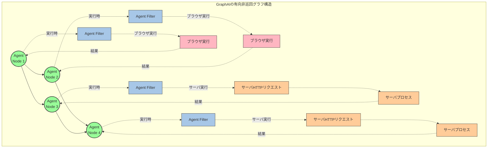

```mermaid

flowchart TD
    subgraph "GraphAIの有向非巡回グラフ構造"
        Node1((Agent\nNode 1)) --> Node2((Agent\nNode 2))
        Node1 --> Node3((Agent\nNode 3))
        Node2 --> Node4((Agent\nNode 4))
        Node3 --> Node4
        
        %% 各ノードの実行フロー
        Node1 -..-> |実行時| Filter1[Agent Filter]
        Node2 -..-> |実行時| Filter2[Agent Filter]
        Node3 -..-> |実行時| Filter3[Agent Filter]
        Node4 -..-> |実行時| Filter4[Agent Filter]
        
        Filter1 -..-> |ブラウザ実行| BrowserExec1[ブラウザ実行]
        Filter2 -..-> |ブラウザ実行| BrowserExec2[ブラウザ実行]
        Filter3 -..-> |サーバ実行| ServerExec1[サーバHTTPリクエスト]
        Filter4 -..-> |サーバ実行| ServerExec2[サーバHTTPリクエスト]
        
        ServerExec1 -..-> Server1[サーバプロセス]
        ServerExec2 -..-> Server2[サーバプロセス]
        
        %% 実行結果の戻り値
        BrowserExec1 -..-> |結果| Node1
        BrowserExec2 -..-> |結果| Node2
        Server1 -..-> |結果| Node3
        Server2 -..-> |結果| Node4
    end
    
    classDef graphNode fill:#98fb98,stroke:#333,stroke-width:2px
    classDef filterNode fill:#a7c7e7,stroke:#333,stroke-width:1px
    classDef browserNode fill:#ffb6c1,stroke:#333,stroke-width:1px
    classDef serverNode fill:#ffcc99,stroke:#333,stroke-width:1px
    
    class Node1,Node2,Node3,Node4 graphNode
    class Filter1,Filter2,Filter3,Filter4 filterNode
    class BrowserExec1,BrowserExec2 browserNode
    class ServerExec1,ServerExec2,Server1,Server2 serverNode

```
