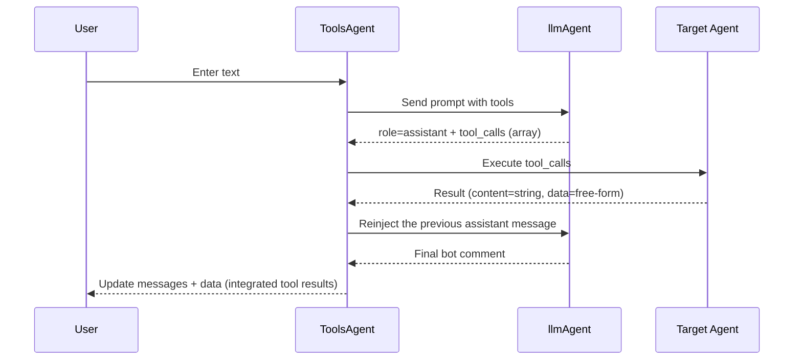

:::message
GraphAI記事の一覧は[こちら](https://zenn.dev/singularity/articles/graphai-index)
:::

## ToolsAgent

GraphAI provides ToolsAgent components that use LLMs to dynamically invoke agents from natural language input.


https://www.npmjs.com/package/@graphai/tools_agent

If you imagine MCP, it’s easier to understand: a ToolsAgent is an agent that allows an LLM to call functions (Agents) by providing the LLM with a tools (function call) schema. Internally, it passes the tools schema to an OpenAI LLM agent, then dynamically calls the appropriate agent(s) within GraphAI based on the tool_calls included in the response.

The process flow is as follows:




## GraphData Definition in GraphAI

When using GraphAI, the GraphData definition is essentially the same as with any LLM agent such as OpenAI.
- Pass messages and prompt to the ToolsAgent.
- You can specify the LLM agent via inputs.llmAgent, though openAIAgent is typically used.
- Pass the schema of the available tools in tools.


```TypeScript
toolsLlmNode: {
  isResult: true,
  agent: "toolsAgent",
  inputs: {
    llmAgent: "openAIAgent",
    tools: ":tools",
    messages: ":messages",
    userInput: {
      text: ":prompt",
    },
  },
}
```

Here is a sample of the data passed to tools.
The main difference from a standard Tools schema is in the function naming convention:
function names are in the format agentName--functionNameWithinAgent.
This is a GraphAI-specific naming rule used to both uniquely identify functions across multiple agents and specify which agent should be called.
Other than this naming rule, the schema conforms to the standard OpenAI tools schema.

```TypeScript
[
  {
    type: "function",
    function: {
      name: "googleMapAgent--setCenter",
      description: "set center location",
      parameters: {
        type: "object",
        properties: {
          lat: {
            type: "number",
            description: "latitude of center",
          },
          lng: {
            type: "number",
            description: "longtitude of center",
          },
        },
        required: ["lat", "lng"],
      },
    },
  },
  {
    type: "function",
    function: {
      name: "googleMapAgent--getCenter",
      description: "get center location",
      parameters: {
        type: "object",
        properties: {},
      },
    },
  },
]
```

When you pass a prompt to this GraphData, GraphAI will either: Invoke a function based on the prompt’s content, or Return a regular chat response.


## Spec for Agents Invoked by toolsAgent

Agents called from a toolsAgent receive data in the following format:

- namedInputs
  - agentName - tool.name(funciton name)
  - arg - tool.arguments
  - func - tool.name(funciton name)
  - data - passthrough from parent


Within the data passed:

- arg contains the arguments generated by the LLM.
- func contains the function name expected within the agent.Even if the agent has only one processing function, func will still be provided. You may ignore it if it is unnecessary.
- For agents with multiple internal operations (e.g., googleMapAgent in the example above), use the func value to determine which operation to execute.

Return value format:

- result
  - content
  - data


- content: Set this to the text that will be passed to the next LLM execution.
- data: Set this to any data returned after GraphAI execution or received via a callback.

## agentFunctionInfo

Set the tools schema in agentFunctionInfo.


## sample


### Agent for Controlling the Google Maps API in the Browser
https://github.com/receptron/graphai-demo-web/blob/main/src/agents/google_map_agent.ts

### Agent for Controlling a Video Player in the Browser
https://github.com/receptron/graphai-demo-web/blob/main/src/agents/video_agent.ts

### mulmo scriptのvalidator
https://github.com/receptron/mulmocast-app/blob/main/src/renderer/agents/mulmo_script_validator.ts

### Agent that uses Exa for web search
https://github.com/receptron/mulmocast-app/blob/main/src/renderer/agents/exa_agent.ts

### Agent that crawls websites on the Node side using Electron
https://github.com/receptron/mulmocast-app/blob/main/src/renderer/agents/puppeteer_agent.ts

### Source code for the ToolsAgent

Implemented in GraphAI

https://github.com/receptron/graphai/blob/main/llm_agents/tools_agent/src/tools_agent.ts


### Sample usage

https://github.com/receptron/mulmocast-app/blob/main/src/renderer/pages/project/chat.vue

https://github.com/receptron/graphai-demo-web/blob/main/src/views/Video.vue

https://github.com/receptron/graphai-demo-web/blob/main/src/views/GoogleMap.vue