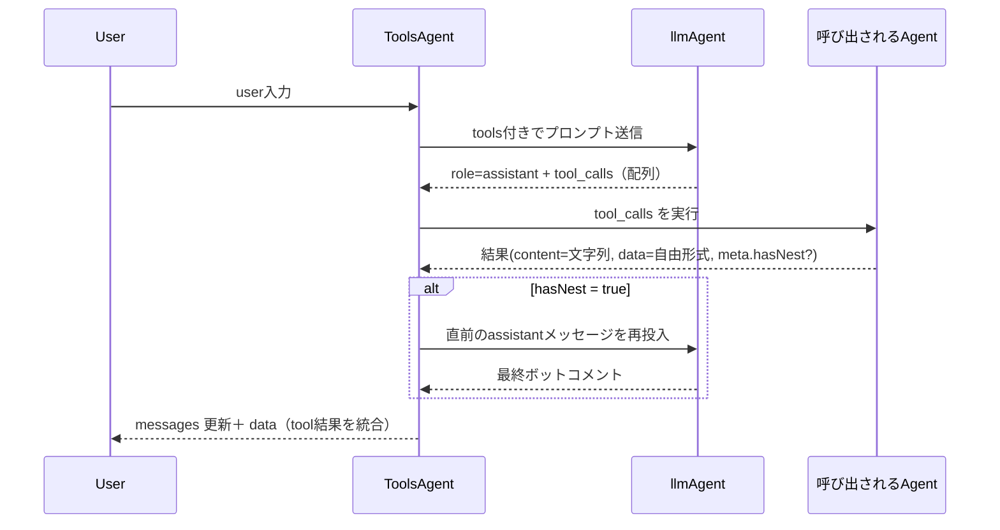

:::message
GraphAI記事の一覧は[こちら](https://zenn.dev/singularity/articles/graphai-index)
:::

## ToolsAgent

GraphAI には、LLM を使って自然言語からエージェントを呼び出すための tools エージェントがあり、内部的には OpenAI などの LLM エージェントに tools のスキーマを渡し、その応答に含まれる tool_calls を基に、GraphAI 内の任意のエージェントを動的に呼び出している。
動作の流れとしては以下のとおりです。




GraphAIのデータ定義は以下。基本的には、openAIなどのllmのagentと同じ。
messagesと、promptを渡す。llmのAgentはinputs.llmAgentに指定する
toolsにはスキーマを渡す。
これで、toolsが、

```
llm: {
  isResult: true,
  agent: "toolsAgent",
  inputs: {
    llmAgent: "openAIAgent",
    tools: ":tools",
    messages: ":messages",
    userInput: {
      text: ":prompt",
    },
  },
},
```
toolsにわたすデータのサンプル。
ちょっと普通と異なるのが関数名が、agent名--agent内部での関数名となっている。
複数のagentの関数を渡すための命名規則です。

```
[
  {
    type: "function",
    function: {
      name: "googleMapAgent--setCenter",
      description: "set center location",
      parameters: {
        type: "object",
        properties: {
          lat: {
            type: "number",
            description: "latitude of center",
          },
          lng: {
            type: "number",
            description: "longtitude of center",
          },
        },
        required: ["lat", "lng"],
      },
    },
  },
  {
    type: "function",
    function: {
      name: "googleMapAgent--getCenter",
      description: "get center location",
      parameters: {
        type: "object",
        properties: {},
      },
    },
  },
]
```

## toolsAgentから呼び出されるagentのspec

- namedInputs
  - agentName - tool.name(funciton name)
  - arg - tool.arguments
  - func - tool.name(funciton name)
  - data - passthrough from parent

- result
  - content
  - data
  - hasNext

- agentFunctionInfo
  - toolsにschema

