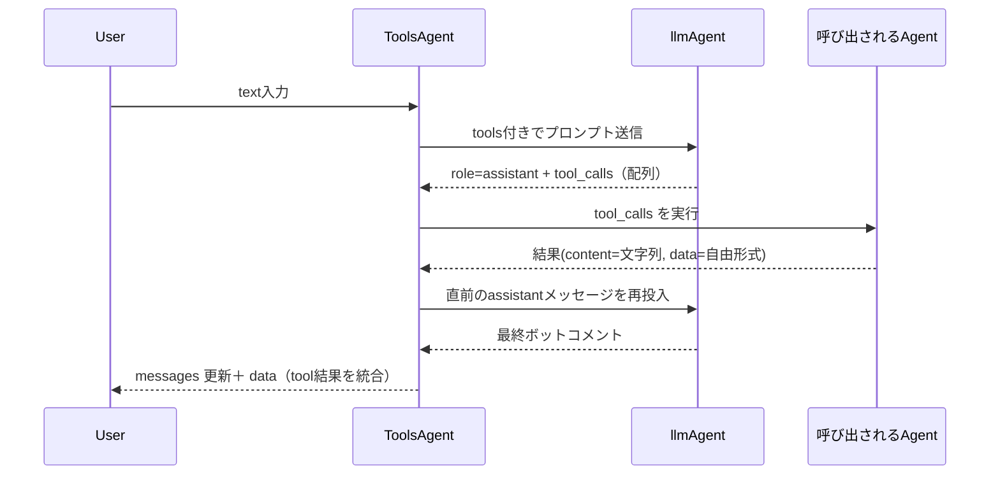

:::message
GraphAI記事の一覧は[こちら](https://zenn.dev/singularity/articles/graphai-index)
:::

## ToolsAgent

GraphAI には、LLM を使って自然言語から動的にエージェントを呼び出すためAgent,  ToolsAgentがあります。

https://www.npmjs.com/package/@graphai/tools_agent

MCPをイメージしていただければわかりやすいですが、ToolsAgentは、Tools(function call) のschemaをllmに渡すことによって、llmが関数(Agent）を呼べるAgentです。内部的に OpenAI の LLM エージェントに tools のスキーマを渡し、その応答に含まれる tool_calls を基に、GraphAI 内の任意のエージェントを動的に呼び出しています。
動作の流れとしては以下のとおりです。




GraphAIで使うときのGraphDataの定義は以下のとおりです。基本的には OpenAI などの LLM エージェントと同じです。
messages と prompt をtoolsAgentに渡します。LLM のエージェントは inputs.llmAgent で指定できますが通常はopenAIAgentを使います。
tools には、利用可能なツールのスキーマを渡します。

```TypeScript
toolsLlmNode: {
  isResult: true,
  agent: "toolsAgent",
  inputs: {
    llmAgent: "openAIAgent",
    tools: ":tools",
    messages: ":messages",
    userInput: {
      text: ":prompt",
    },
  },
}
```

tools に渡すデータのサンプルです。
一般的なToolsのSchemaと異なる点として、関数名は agent名--agent内部での関数名 という形式になっている部分です。
これは、GraphAI独自の命名規則で、複数のエージェントで関数をユニークにし、かつ呼び出すAgentを指定するための命名規則です。
それ以外の部分は、一般的な OpenAI の tools スキーマに準拠しています。

```TypeScript
[
  {
    type: "function",
    function: {
      name: "googleMapAgent--setCenter",
      description: "set center location",
      parameters: {
        type: "object",
        properties: {
          lat: {
            type: "number",
            description: "latitude of center",
          },
          lng: {
            type: "number",
            description: "longtitude of center",
          },
        },
        required: ["lat", "lng"],
      },
    },
  },
  {
    type: "function",
    function: {
      name: "googleMapAgent--getCenter",
      description: "get center location",
      parameters: {
        type: "object",
        properties: {},
      },
    },
  },
]
```

このGraphDataにpromptを渡すと、promptの内容を判断して関数を呼び出したり、通常のチャットを返します。


## toolsAgentから呼び出されるagentのspec

toolsAgentから呼び出されるagentは以下のようにデータが渡されます。

- namedInputs
  - agentName - tool.name(funciton name)
  - arg - tool.arguments
  - func - tool.name(funciton name)
  - data - passthrough from parent

argでllmが生成した引数、funcでagent内で想定される関数名が渡されます。
agentの処理が１つしかない場合でもfuncは渡されます。不要であれば無視してください。
上記例のgoogleMapAgentのような内部で複数の処理を持つagentはfuncをみて、動作内容を切り替えます。

返却値は以下です

- result
  - content
  - data

contentには続けて実行するllmに渡すテキストをセットします。
dataはGraphAIの実行後、もしくはcallbackで受け取るデータをセットします。

## agentFunctionInfo

agentFunctionInfoにtoolsのスキーマをセットします

- agentFunctionInfo
  - toolsにschemaを定義する


## sample


### ブラウザのGoogle map apiを操作するAgent
https://github.com/receptron/graphai-demo-web/blob/main/src/agents/google_map_agent.ts

### ブラウザのVideo playerを操作するAgent
https://github.com/receptron/graphai-demo-web/blob/main/src/agents/video_agent.ts

### mulmo scriptのvalidator
https://github.com/receptron/mulmocast-app/blob/main/src/renderer/agents/mulmo_script_validator.ts

### exaと使ってweb検索するAgent
https://github.com/receptron/mulmocast-app/blob/main/src/renderer/agents/exa_agent.ts

### electronを使ってnode側でwebサイトをクロールするAgent
https://github.com/receptron/mulmocast-app/blob/main/src/renderer/agents/puppeteer_agent.ts

### Tools Agentのソース

GraphAIで実装されています

https://github.com/receptron/graphai/blob/main/llm_agents/tools_agent/src/tools_agent.ts


### 利用しているサンプル

https://github.com/receptron/mulmocast-app/blob/main/src/renderer/pages/project/chat.vue

https://github.com/receptron/graphai-demo-web/blob/main/src/views/Video.vue

https://github.com/receptron/graphai-demo-web/blob/main/src/views/GoogleMap.vue