:::message
GraphAI記事の一覧は[こちら](https://zenn.dev/singularity/articles/graphai-index)
:::

## ToolsAgent

GraphAI には、LLM を使って自然言語からエージェントを呼び出すための tools エージェントがあります。
内部的には OpenAI などの LLM エージェントに tools のスキーマを渡し、その応答に含まれる tool_calls を基に、GraphAI 内の任意のエージェントを動的に呼び出している。
動作の流れとしては以下のとおりです。

```mermaid

sequenceDiagram
    participant U as User
    participant GA as ToolsAgent
    participant L as llmAgent
    participant T as 呼び出されるAgent

    U->>GA: text入力
    GA->>L: tools付きでプロンプト送信
    L-->>GA: role=assistant + tool_calls（配列）
    GA->>T: tool_calls を実行
    T-->>GA: 結果(content=文字列, data=自由形式, meta.hasNest?)
    alt hasNest = true
      GA->>L: 直前のassistantメッセージを再投入
      L-->>GA: 最終ボットコメント
    end
    GA-->>U: messages 更新＋ data（tool結果を統合）
```




GraphAI のデータ定義は以下のとおりで、基本的には OpenAI などの LLM エージェントと同様である。
messages と prompt を渡し、LLM のエージェントは inputs.llmAgent に指定する。
tools には、利用可能なツールのスキーマを渡します。

```
llm: {
  isResult: true,
  agent: "toolsAgent",
  inputs: {
    llmAgent: "openAIAgent",
    tools: ":tools",
    messages: ":messages",
    userInput: {
      text: ":prompt",
    },
  },
},
```

tools に渡すデータのサンプル。
通常と異なる点として、関数名は agent名--agent内部での関数名 という形式になっている。
これは、複数のエージェントの関数を同時に渡すための命名規則である。
それ以外の部分は、一般的な OpenAI の tools スキーマに準拠している。


```
[
  {
    type: "function",
    function: {
      name: "googleMapAgent--setCenter",
      description: "set center location",
      parameters: {
        type: "object",
        properties: {
          lat: {
            type: "number",
            description: "latitude of center",
          },
          lng: {
            type: "number",
            description: "longtitude of center",
          },
        },
        required: ["lat", "lng"],
      },
    },
  },
  {
    type: "function",
    function: {
      name: "googleMapAgent--getCenter",
      description: "get center location",
      parameters: {
        type: "object",
        properties: {},
      },
    },
  },
]
```


## toolsAgentから呼び出されるagentのspec

- namedInputs
  - agentName - tool.name(funciton name)
  - arg - tool.arguments
  - func - tool.name(funciton name)
  - data - passthrough from parent

- result
  - content
  - data
  - hasNext

- agentFunctionInfo
  - toolsにschema

